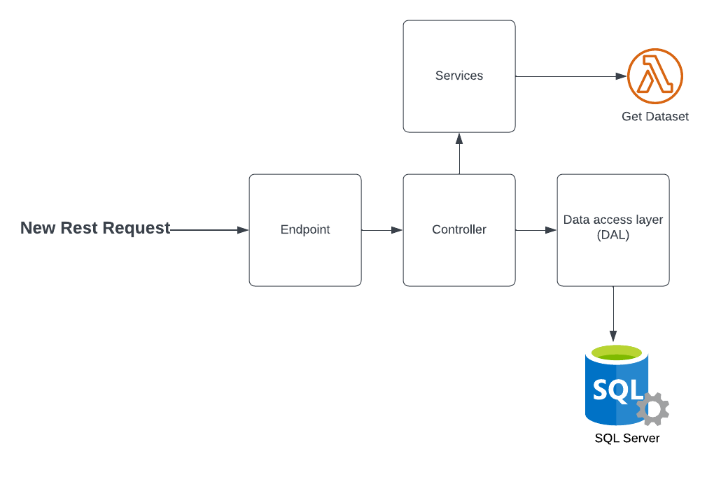
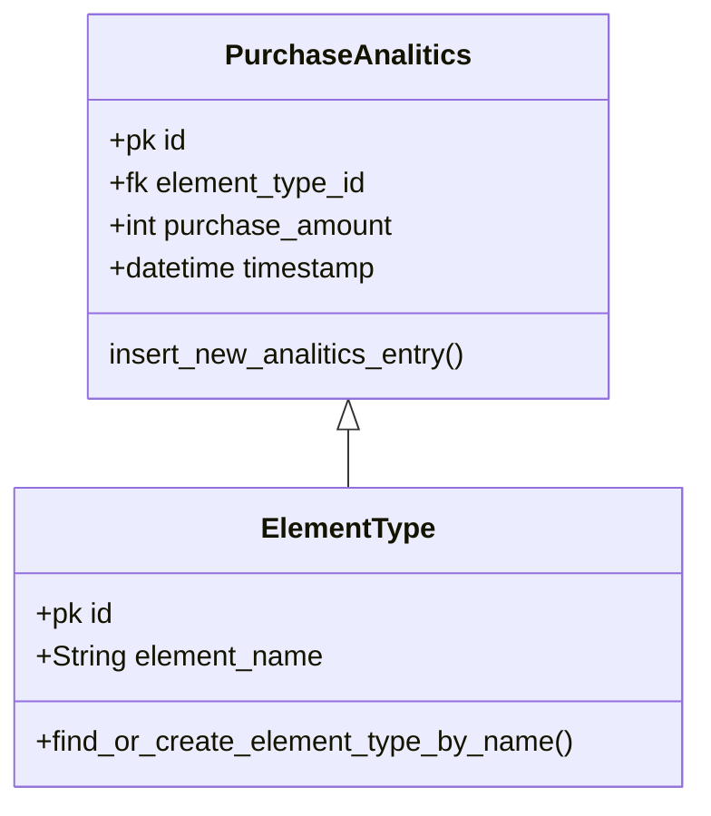

# DataAnalytics
This example project gets a dataset from a aws lambda method, analizes the data and stores the results in DB

## Table of contents
* [Project Requirements](#project-requirements)
* [Used Libraries](#used-libraries)
* [How to run the project](#how-to-run-the-project)
* [Project Diagram](#project-diagram)
* [Database Diagram](#database-diagram)

## Project Requirements
* Python 3
* Python Virtual Environments
* SQL Server Database

## Used Libraries
* Flask
* Pandas
* SQL Alchemy
* Pyodbc
* Requests

## How to run the project

1. Create a .env file (In the project is a .env.backup that can be used as an example) adding the database username and password.
2. Create a new virtualenv
3. Activate the virtualenv
4. Run `pip install -r requirements.txt`
5. To create the models in DB run `flask shell` and after inside the flask shell run the following commands:

```python
from dal.db import db
from dal.models.elementType import ElementType
from dal.models.purchaseAnalitics import PurchaseAnalitics

db.create_all()

```

6. Finally run `flask run` to run the debug server, in the terminal you will find the endpoint to test the project

## Project Diagram


This project is built for scalability, creating strong limits that make it easy to modify and use, the only way to communicate with the database is using the DAL interface, this should connect only with the controller, and the controller returns the processed data to the Endpoint returning the data to the user.

## Database Diagram

